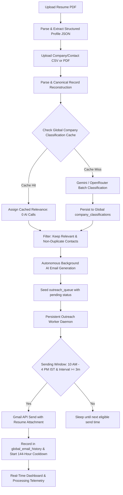
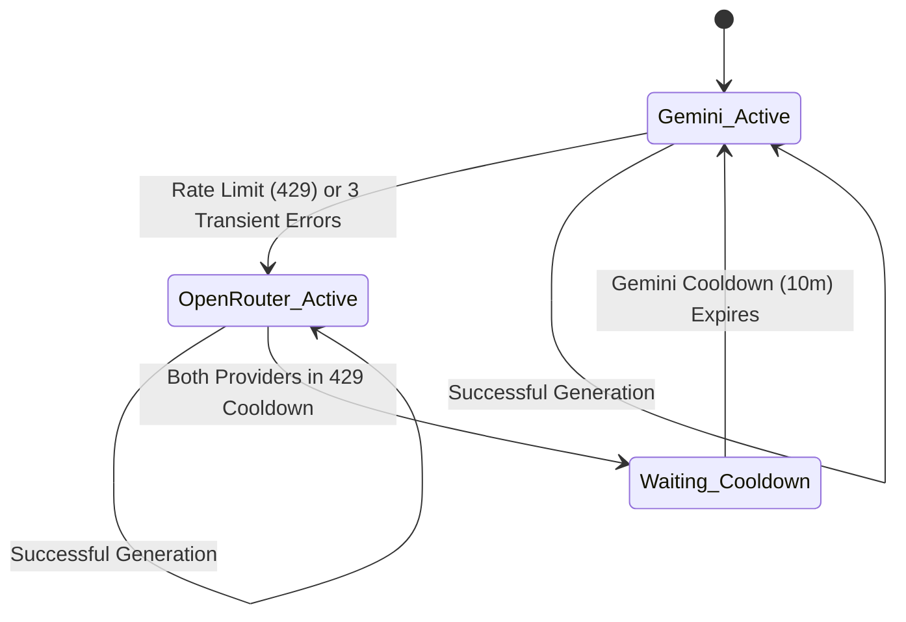
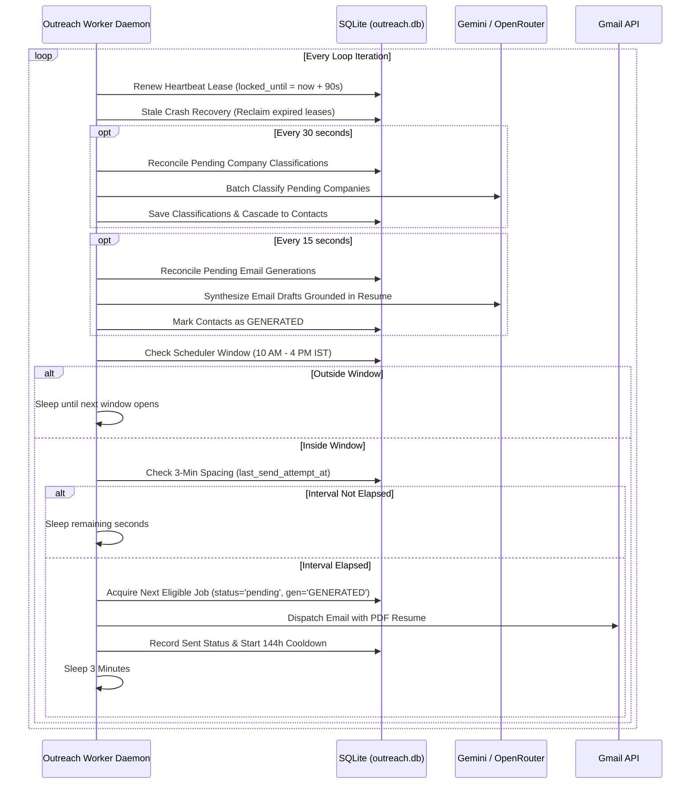

# AI Job Outreach Agent

[](https://nextjs.org/)
[](https://react.dev/)
[](https://www.typescriptlang.org/)
[](https://tailwindcss.com/)
[](https://www.sqlite.org/)
[](https://orm.drizzle.team/)
[](https://ai.google.dev/)
[](https://openrouter.ai/)
[](https://developers.google.com/gmail/api)
[](https://railway.app/)

> An autonomous, local-first cold outreach system built for software engineers and technology professionals. Ingests recruiter contacts from raw CSV or PDF files, classifies company relevance via AI, grounds hyper-personalized email drafts in candidate resume facts, enforces disciplined sending hygiene (10:00 AM – 4:00 PM IST, 3-minute pacing, 144-hour cooldown), and delivers emails safely through the official Gmail API.

---

## 📑 Table of Contents

- [1. Project Overview](#1-project-overview)
- [2. Key Features](#2-key-features)
- [3. Technology Stack](#3-technology-stack)
- [4. System Architecture](#4-system-architecture)
- [5. Directory / Codebase Structure](#5-directory--codebase-structure)
- [6. Complete User Guide](#6-complete-user-guide)
- [7. Input File Requirements](#7-input-file-requirements)
- [8. Company Classification System](#8-company-classification-system)
- [9. Company Identity & Normalization](#9-company-identity--normalization)
- [10. AI Email Generation System](#10-ai-email-generation-system)
- [11. AI Providers & Failover Engine](#11-ai-providers--failover-engine)
- [12. Gmail Integration & OAuth 2.0](#12-gmail-integration--oauth-20)
- [13. Email Sending Rules & Scheduling](#13-email-sending-rules--scheduling)
- [14. Email Cooldown & Duplicate Protection](#14-email-cooldown--duplicate-protection)
- [15. Database Architecture & Schema](#15-database-architecture--schema)
- [16. Queue & Worker Architecture](#16-queue--worker-architecture)
- [17. Resume Management & Versioning](#17-resume-management--versioning)
- [18. Dashboard & Processing Pipeline UI](#18-dashboard--processing-pipeline-ui)
- [19. Environment Variables Reference](#19-environment-variables-reference)
- [20. Local Development Setup](#20-local-development-setup)
- [21. Production Deployment (Railway)](#21-production-deployment-railway)
- [22. Backup & Data Persistence](#22-backup--data-persistence)
- [23. Error Handling & Troubleshooting](#23-error-handling--troubleshooting)
- [24. Administrative & Recovery Features](#24-administrative--recovery-features)
- [25. Security & Cryptography](#25-security--cryptography)
- [26. Privacy & Data Handling](#26-privacy--data-handling)
- [27. Automated Testing Suite](#27-automated-testing-suite)
- [28. Developer Maintenance Guide](#28-developer-maintenance-guide)
- [29. Architectural Invariants (Do Not Break)](#29-architectural-invariants-do-not-break)
- [30. Complete End-to-End Walkthrough](#30-complete-end-to-end-walkthrough)
- [31. Frequently Asked Questions (FAQ)](#31-frequently-asked-questions-faq)
- [32. Project Glossary](#32-project-glossary)
- [33. Architectural Change History](#33-architectural-change-history)
- [34. Future Architecture (Planned Improvements)](#34-future-architecture-planned-improvements)

---

## 1. Project Overview

### What is the AI Job Outreach Agent?
The **AI Job Outreach Agent** is a full-stack, automated job application and recruiter outreach agent designed specifically for candidates seeking Software Engineering, Computer Science, IT, Cloud, Data, AI/ML, and Cybersecurity roles.

Instead of treating outreach as an indiscriminate blast of templated emails, the application functions as an intelligent pipeline that:
1. Filters out non-technical organizations (e.g. construction, catering, retail, hospitals).
2. Synthesizes personalized, context-aware emails tailored to each company and recruiter.
3. Enforces professional sending etiquette (humanized pacing, business hours, and global duplicate cooldowns).

### The Problem It Solves
Job seekers face significant friction during job hunts:
- **Manual Burnout:** Composing hundreds of thoughtful emails across spreadsheets takes dozens of hours every week.
- **Generic Mass Mailers:** Traditional mail-merge tools blast identical boilerplate templates that end up in Gmail spam folders, burn sender reputation, and damage candidate credibility.
- **Accidental Spamming:** Without cross-file deduplication, candidates repeatedly email the same recruiter whenever new CSV lists are downloaded.
- **Unprofessional Timing:** Sending emails at 2:00 AM on Sunday ruins open rates and signals poor business hygiene.

### Who Is It Intended For?
- Software engineers, computer science graduates, and IT job seekers seeking internships, junior roles, or senior positions.
- Developers who want self-hosted, sovereign control over their data, their Gmail tokens, and their AI API usage without paying SaaS subscription fees.

### High-Level Workflow



---

## 2. Key Features

- **Multi-Format Ingestion:** Ingests raw CSV and PDF files containing recruiter contacts.
- **Fuzzy Header Mapping:** Automatically detects and normalizes headers like `Company`, `Organization`, `Recruiter Name`, `HR Contact`, `Email Address`, `Mail ID`, `Website`, and `Designation`.
- **Continuation Row Context Forward-Filling:** Correctly inherits company context across blank, ditto (`"`, `''`), or merged cells in multi-contact files.
- **OCR Fallback (`tesseract.js`):** Automatically extracts contact data from image-based or scanned PDFs when direct text extraction yields sparse content.
- **CS/IT Relevance Classification:** Uses Google Gemini (`gemini-3.8-flash`) to verify whether companies hire for computer science, software engineering, IT, data, or digital roles.
- **Global Classification Knowledge Base:** Caches all completed company evaluations permanently in SQLite (`company_classifications`), ensuring 0 redundant AI calls on re-uploaded companies.
- **Multi-Provider AI Resilience:** Native failover between Google Gemini and OpenRouter (`openrouter/free` or custom models) with circuit-breaker protection on rate limits (HTTP 429).
- **Autonomous Background Email Preparation:** Generates personalized email subject lines, body paragraphs, and strategies ahead of time so the sending worker is never blocked waiting for AI generation.
- **Resume Grounding (Zero Hallucinations):** Strict prompt engineering ensures generated emails only cite projects, skills, degrees, and technologies present in the candidate's uploaded resume.
- **Resume Version Locking:** Changing the candidate resume locks previously generated emails and triggers automatic regeneration before sending, preventing mismatched resume attachments.
- **OAuth 2.0 Gmail Delivery:** Sends real emails directly through the candidate's authenticated Google account using the official `googleapis` library with minimal `gmail.send` scope.
- **AES-256-GCM Encrypted Storage:** Encrypts sensitive OAuth tokens at rest in SQLite using authenticated Galois/Counter Mode encryption.
- **Strict Sending Discipline:** Sends exclusively between **10:00 AM and 4:00 PM IST** (configurable) with a **minimum 3-minute interval** between real email dispatches.
- **144-Hour (6-Day) Global Cooldown:** Automatically tracks all successfully contacted email addresses in `global_email_history` to prevent duplicate outreach across different files and batches.
- **Dry-Run Simulation Mode:** Enables testing the entire ingestion, classification, generation, and scheduling pipeline (`OUTREACH_DRY_RUN=true`) without sending a single real email.
- **Single-Service Railway Deployment:** Runs both Next.js and the background worker inside a single Railway container using a Node.js process supervisor and persistent `/data` volume.
- **Real-Time Interactive Dashboard:** Features 7 canonical drill-down metric cards, live AI provider status telemetry, scheduler pause/resume/stop controls, and a multi-tab processing pipeline monitor.

---

## 3. Technology Stack

| Technology / Library | Version | Purpose | How / Where Used |
| :--- | :--- | :--- | :--- |
| **Next.js** | `16.3.4` | Full-stack Web Framework | App Router UI pages, API endpoints, server-side data loading |
| **React / React DOM** | `19.2.8` | UI Library | Client components, interactive modals, real-time polling |
| **TypeScript** | `^5` | Strict Type Checking | End-to-end type safety, schema definitions, domain models |
| **Tailwind CSS** | `^4` | CSS-First Styling | UI layout, modern design system configured via `globals.css` |
| **Lucide React** | `^1.40.0` | Icon Library | Clean dashboard, status, and navigation icons |
| **SQLite (`better-sqlite3`)** | `^13.0.3` | Persistent Database | Local-first relational database with Write-Ahead Logging (WAL) |
| **Drizzle ORM** | `^0.45.2` | Relational ORM | Type-safe schema definitions, migrations, joins, and queries |
| **Google GenAI SDK (`@google/genai`)** | `^2.21.0` | Primary AI Provider | Powers `gemini-3.8-flash` for company classification & email synthesis |
| **OpenRouter API** | REST | Fallback AI Provider | Automatic secondary AI failover when Gemini hits rate limits |
| **Google APIs (`googleapis`)** | `^178.0.0` | Gmail Integration | Official Gmail API client for OAuth 2.0 authentication & sending |
| **`csv-parse`** | `^7.0.2` | Delimited File Parsing | Streaming CSV parsing and column extraction |
| **`pdf-parse`** | `^1.1.1` | PDF Parsing | Extracts raw text from candidate resumes and contact PDF lists |
| **`tesseract.js`** | `^7.0.0` | Optical Character Recognition | Extracts contact text from scanned or image-based PDF pages |
| **`ulid`** | `^3.0.2` | Unique Identifiers | Lexicographically sortable, collision-free primary keys (`batch_*`, `cont_*`, `queue_*`) |
| **Node.js Crypto** | Core | Security & Hashes | AES-256-GCM token encryption, timing-safe string comparison, SHA-256 |
| **`tsx`** | `^4.23.13` | TypeScript Execution | Runs the standalone background outreach worker daemon |
| **Railway** | Cloud | Production Deployment | Container hosting with persistent volume mounted at `/data` |

---

## 4. System Architecture

The system uses a **decoupled, local-first architecture** where Next.js handles user interactions and API requests, while a standalone worker process executes background tasks. Both processes share a single SQLite database in Write-Ahead Logging (WAL) mode.

```mermaid
flowchart TD
    subgraph Web Process (Next.js 16)
        UI[Dashboard / Upload / Settings UI]
        API_Upload[/api/upload]
        API_Resume[/api/resume]
        API_Gmail[/api/gmail/*]
        API_Scheduler[/api/scheduler/*]
        API_Dashboard[/api/dashboard/*]
        API_Admin[/api/admin/recover-historical-failures]
    end

    subgraph Persistent Storage (/data)
        DB[(SQLite: outreach.db WAL Mode)]
        ResumesDir[/data/resumes]
        UploadsDir[/data/uploads]
    end

    subgraph Outreach Worker Daemon (src/worker/outreach-worker.ts)
        LeaseLock[Worker Heartbeat Lease (90s)]
        ClassReconciler[Company Classification Reconciler (every 30s)]
        GenReconciler[Autonomous Email Generator (every 15s)]
        SchedulerEngine[Sending Window & 3-Min Pacing Engine]
        StaleRecovery[Crash / Stale Lease Recovery]
    end

    subgraph External Cloud Services
        Gemini[Google Gemini API (gemini-3.8-flash)]
        OpenRouter[OpenRouter Fallback API]
        GoogleOAuth[Google OAuth 2.0]
        GmailSend[Gmail REST API (gmail.send)]
    end

    UI --> API_Upload & API_Resume & API_Gmail & API_Scheduler & API_Dashboard & API_Admin
    API_Upload --> UploadsDir
    API_Resume --> ResumesDir
    API_Upload & API_Resume & API_Scheduler & API_Admin --> DB

    LeaseLock --> DB
    ClassReconciler --> DB
    GenReconciler --> DB
    SchedulerEngine --> DB
    StaleRecovery --> DB

    ClassReconciler & GenReconciler --> Gemini
    Gemini -- 429 Cooldown --> OpenRouter

    API_Gmail <--> GoogleOAuth
    SchedulerEngine --> GmailSend
```

### Process Coordination & State Sharing
1. **Database-as-Coordinator:** The web process and the worker do not communicate via HTTP or sockets. All coordination happens through atomic transactions and state columns in SQLite.
2. **Atomic Worker Lease Locking:** The outreach worker registers a unique `worker_id` and maintains an active heartbeat lease (`locked_until = now + 90s`) in `scheduler_state`. This guarantees that only one worker instance can send emails at any time.
3. **Multi-Process AI Telemetry:** AI provider state (`activeProvider`, cooldown timers, 429 counters) is stored in the `ai_provider_state` table so changes triggered by the worker are immediately visible to the dashboard UI.

---

## 5. Directory / Codebase Structure

```
ai-job-outreach-agent/
├── data/                                 # Default local persistent data directory [gitignored]
│   ├── outreach.db                       # Primary SQLite database
│   ├── resumes/                          # Stored resume PDF files
│   └── uploads/                          # Stored contact CSV and PDF files
├── scripts/
│   ├── start-railway.js                  # Production supervisor for Railway (spawns Next.js + worker)
│   └── check-db.ts                       # Database inspection utility
├── src/
│   ├── app/                              # Next.js App Router
│   │   ├── api/                          # REST API endpoints
│   │   │   ├── admin/                    # Administrative routes (recover-historical-failures)
│   │   │   ├── batches/                  # Batch inspection, contacts, and deletion
│   │   │   ├── classifications/          # Read-only classification knowledge base inspection
│   │   │   ├── contacts/                 # Contact list, filtering, and manual regeneration
│   │   │   ├── dashboard/                # Statistics, companies, and processing pipeline queries
│   │   │   ├── generate/                 # Manual email generation trigger
│   │   │   ├── gmail/                    # OAuth authorization, callback, status, disconnect, test-send
│   │   │   ├── init/                     # Database initialization trigger
│   │   │   ├── resume/                   # Resume upload, profile parsing, and retrieval
│   │   │   ├── scheduler/                # Pause, resume, stop, and status controls
│   │   │   ├── settings/                 # Global settings configuration
│   │   │   └── upload/                   # File upload ingestion pipeline
│   │   ├── batches/                      # Batch list and detail view pages
│   │   ├── contacts/                     # Contact directory and email preview modal
│   │   ├── settings/                     # Gmail OAuth connection, resume upload, scheduler settings
│   │   ├── upload/                       # Drag-and-drop file upload interface
│   │   ├── globals.css                   # Tailwind CSS v4 design tokens and theme styles
│   │   ├── layout.tsx                    # Root application layout with sidebar navigation
│   │   └── page.tsx                      # Main operations dashboard with real-time refresh
│   ├── components/                       # React UI Components
│   │   ├── dashboard/                    # Stat cards, detail modals, processing pipeline tabs
│   │   ├── layout/                       # Sidebar, header, navigation controls
│   │   └── ui/                           # Base UI primitives (Card, Badge, Button, Modal)
│   ├── db/                               # Relational Database Layer
│   │   ├── schema/                       # Drizzle schema definitions
│   │   │   ├── ai-provider-state.ts      # Multi-provider failover state & telemetry
│   │   │   ├── batches.ts                # Uploaded file records & aggregate metrics
│   │   │   ├── company-classifications.ts# Global company relevance cache & retry rounds
│   │   │   ├── contacts.ts               # Contact entities, relevance, email drafts, generation state
│   │   │   ├── global-email-history.ts   # 144-hour cooldown & sent-email registry
│   │   │   ├── outreach-queue.ts         # Priority dispatch queue & worker leases
│   │   │   ├── resume.ts                 # Candidate profile, parsed text, and version hash
│   │   │   ├── scheduler-state.ts        # Singleton scheduler state, daily sent counter, worker lease
│   │   │   └── settings.ts               # Key-value configuration & encrypted OAuth tokens
│   │   ├── index.ts                      # SQLite singleton connection with WAL mode & busy timeout
│   │   ├── migrate.ts                    # Idempotent raw-SQL schema migrations
│   │   └── seed.ts                       # Default database seeding logic
│   ├── lib/                              # Core Business Logic & Pipelines
│   │   ├── ai/                           # AI Dispatcher, Gemini client, OpenRouter client, parser
│   │   ├── config/                       # Environment variables, paths, and URL helpers
│   │   ├── gmail/                        # Google OAuth client, MIME message builder, email dispatch
│   │   ├── parsers/                      # CSV parser, PDF extractor, Tesseract OCR, field mapper
│   │   ├── pipeline/                     # Batch processor, canonical ingestion, reconcilers
│   │   ├── scheduler/                    # Queue manager, worker lease, time window calculations
│   │   ├── security/                     # AES-256-GCM encryption & constant-time comparison
│   │   ├── utils/                        # Company name normalization, email validation, formatters
│   │   └── db-helpers.ts                 # Database queries and dashboard aggregation wrappers
│   ├── types/                            # Shared TypeScript interfaces and domain types
│   └── worker/
│       └── outreach-worker.ts            # Standalone background outreach worker daemon
├── tests/                                # Comprehensive automated test suites (30+ files)
├── .env.example                          # Environment variable template
├── drizzle.config.ts                     # Drizzle Kit configuration
├── package.json                          # Dependencies, engines, and run scripts
└── tsconfig.json                         # TypeScript configuration
```

---

## 6. Complete User Guide

### Step 1 — Start the Application
- Start the web dashboard:
  ```bash
  npm run dev
  ```
- Start the background worker daemon in a separate terminal:
  ```bash
  npm run worker
  ```
- Open [http://localhost:3000](http://localhost:3000) in your browser.

### Step 2 — Configure Environment Settings
- Verify that your `.env.local` contains valid API keys for Gemini (`GEMINI_API_KEY`) and Google OAuth (`GOOGLE_CLIENT_ID`, `GOOGLE_CLIENT_SECRET`).
- Verify that your timezone is properly configured (`USER_TIMEZONE=Asia/Kolkata`).

### Step 3 — Connect Your Gmail Account
1. Navigate to **Settings** (`/settings`) from the left sidebar.
2. Locate the **Gmail Connection** card.
3. Click **Connect Gmail Account**. You will be redirected to Google's OAuth consent screen.
4. Authorize the application with the `gmail.send` scope.
5. Upon redirect back to the app, verify the card displays a green badge: `Connected: your-email@gmail.com`.
6. Click **Send Test Email** to send a verification message to your own inbox.

### Step 4 — Upload Your Resume
1. In **Settings** (`/settings`), scroll down to **Candidate Resume**.
2. Upload your resume in `.pdf` format.
3. The system parses the document, extracts your technical skills, work experience, degrees, and project details, and generates a structured JSON profile.
4. Verify that the resume filename and extraction timestamp appear on the card.

### Step 5 — Prepare Company / Recruiter Data
Prepare a CSV or PDF file containing company names, contact names, and email addresses. Standard column headers like `Company`, `Recruiter`, `Email`, `Designation`, and `Website` are automatically detected.

### Step 6 — Upload Contact File
1. Navigate to **Upload** (`/upload`).
2. Drag and drop your CSV or PDF file into the upload zone.
3. Click **Upload & Process Batch**.
4. The system parses the records, runs canonical forward-filling across continuation rows, validates email syntax, and filters duplicates against the 144-hour cooldown registry.

### Step 7 — Understand Company Classification
- Uncached companies are evaluated via AI in batches of 20.
- Companies determined to hire for CS/IT/software roles are marked `RELEVANT`. Non-technical businesses are marked `IRRELEVANT`.
- Classification results are saved permanently in `company_classifications`. If you upload another file containing the same companies later, the system reuses the cached decision with **0 AI calls**.

### Step 8 — Understand Generated Emails
- For every eligible contact (`isRelevant = true`, valid email, not duplicate), the autonomous background generator synthesizes a tailored email subject line and body grounded in your resume facts.
- You can preview, edit, or regenerate email drafts at any time from the **Contacts** page (`/contacts`).

### Step 9 — Understand the Queue
- When contacts are marked `queued`, an entry is created in `outreach_queue` with `status = 'pending'`.
- The queue operates on a priority basis. If the system restarts or crashes, uncompleted jobs remain safely in the queue.

### Step 10 — Understand Email Sending
- The background outreach worker monitors the queue.
- When the local time is between **10:00 AM and 4:00 PM IST**, the worker picks up the next eligible contact, attaches your resume PDF, and dispatches the email via Gmail.
- After every successful real send, the worker pauses for **exactly 3 minutes** before processing the next job.

### Step 11 — Monitor the Dashboard
- Open the **Dashboard** (`/`).
- The 7 metric cards update every 6 seconds to reflect total companies, relevant tech firms, contacts found, queued emails, generated drafts, and sent messages.
- You can pause or stop outreach at any moment using the control buttons in the top header.

### Step 12 — Sent History & Global Cooldown
- When an email is delivered, the contact's email address is recorded in `global_email_history` with a timestamp (`sent_at`).
- This email is now protected by an automatic **144-hour (6-day) cooldown**.

### Step 13 — Uploading Additional Batches
- You can upload new contact files at any time.
- The system automatically deduplicates contacts against active batches and the 144-hour cooldown, ensuring no recruiter is emailed twice.

---

## 7. Input File Requirements

### Supported File Formats
1. **CSV Files (`.csv`):** Comma, tab, or pipe-separated tabular text files.
2. **PDF Files (`.pdf`):** Text-based tabular lists or scanned document pages (processed via `tesseract.js` OCR).

### Detected Column Variations (Field Mapping)
The ingestion parser detects common column headers automatically:

| Normalized Field | Recognized Column Names in Header | Required? |
| :--- | :--- | :--- |
| `company_name` | `company`, `company name`, `organization`, `organisation`, `employer`, `firm`, `business`, `client` | Yes |
| `contact_name` | `hr name`, `recruiter`, `contact person`, `contact name`, `name`, `full name`, `talent acquisition`, `poc` | Optional |
| `email` | `email`, `email address`, `hr email`, `recruiter email`, `contact email`, `e-mail`, `work email`, `mail` | **Yes** |
| `designation` | `designation`, `title`, `job title`, `role`, `position` | Optional |
| `company_website` | `website`, `company website`, `url`, `web`, `domain` | Optional |
| `company_location` | `location`, `city`, `address`, `country` | Optional |

### Handling Continuation Rows & Merged Cells
Recruiter lists often list a company once followed by multiple recruiters on subsequent lines with empty company cells:

```csv
Company Name,Recruiter Name,Email Address
Google LLC,Priya Sharma,psharma@google.com
,Amit Patel,apatel@google.com
",Neha Singh,nsingh@google.com
Microsoft,Rajesh Kumar,rkumar@microsoft.com
```

The canonical ingestion engine (`reconstructCanonicalContacts`) handles this automatically:
- **Forward-Filling:** Empty cells or ditto marks (`"`, `''`, `-`, `do`, `same`) inherit the active company context from the preceding row.
- **Context Isolation:** As soon as a new non-blank company is encountered (e.g. `Microsoft`), the context immediately switches, preventing cross-company contamination.

---

## 8. Company Classification System

```mermaid
flowchart TD
    A[Company Input from File] --> B[normalizeCompanyName]
    B --> C[Check In-Memory Cache]
    C -- Hit --> D[Return Classification]
    C -- Miss --> E[Check SQLite: company_classifications]
    E -- Authoritative Hit (RELEVANT/IRRELEVANT/NEEDS_REVIEW) --> F[Return Cached Classification: 0 AI Calls]
    E -- Miss or Pending --> G[Add to toClassify Batch (Max 20)]
    G --> H[Dispatch to AI Provider (Gemini -> OpenRouter)]
    H -- Success --> I[Persist to company_classifications]
    H -- Rate Limit (429) --> J[Mark Attempted as RETRY_WAITING]
    J --> K[Mark Remaining as PENDING]
    I --> L[Cascade to Contacts in Batch]
```

### Classification Statuses

| Classification Status | Relevance | Meaning | Downstream Action |
| :--- | :--- | :--- | :--- |
| `RELEVANT` | `true` | Company operates in Software, IT, Cloud, Data, AI/ML, or SaaS | Contact set to `queued`, queued for sending |
| `IRRELEVANT` | `false` | Company is non-tech (construction, hospitality, retail, healthcare) | Contact set to `skipped`, 0 emails sent |
| `NEEDS_REVIEW` | `null` | Company name is ambiguous or lacks technical context | Contact set to `uncertain`, requires manual review |
| `PENDING` | `null` | Queued for initial AI classification pass | Picked up by worker reconciler |
| `RETRY_WAITING` | `null` | Rate limit or transient error encountered during classification | Waits for current round to drain before retry |
| `FAILED` | `null` | Maximum retry rounds (5) exceeded or permanent configuration error | Retained in database for audit |

### Batch-Scoped Round Drainage Rule
To prevent rate-limit thrashing and queue starvation:
- Classification retries operate in rounds (Round 0 to 5).
- A batch's `RETRY_WAITING` records **cannot** be promoted to the next retry round until all active `PENDING` (Round 0 / unattempted) records for that specific batch have reached 0.

---

## 9. Company Identity & Normalization

Company names are normalized via [`normalizeCompanyName()`](src/lib/utils/company.ts) before being queried or stored in the database.

### Normalization Pipeline
1. Trims leading and trailing whitespace and converts all characters to lowercase.
2. Replaces punctuation characters (`[,.-/\_]`) with spaces.
3. Collapses multiple consecutive spaces into a single space.
4. Strips recognized corporate legal suffixes using word boundaries:
   `pvt ltd`, `private limited`, `ltd`, `limited`, `llc`, `inc`, `incorporated`, `corp`, `corporation`, `co`, `company`, `gmbh`, `technologies`, `technology`, `services`, `solutions`.

### Normalization Examples

| Input Company String | Normalized Key (`normalized_name`) | Cached Entity Match |
| :--- | :--- | :--- |
| `"Google, LLC"` | `"google"` | Matches `"Google"` |
| `"Google Inc."` | `"google"` | Matches `"Google"` |
| `"Microsoft Corporation"` | `"microsoft"` | Matches `"Microsoft"` |
| `"HCL Technologies Ltd"` | `"hcl"` | Matches `"HCL"` |
| `"Tata Consultancy Services"` | `"tata consultancy"` | Matches `"Tata Consultancy"` |
| `"Google India"` | `"google india"` | Separate entity (`india` is geographical, not a legal suffix) |

---

## 10. AI Email Generation System

```mermaid
flowchart TD
    A[Queued Contact with isRelevant = true] --> B[Acquire Generation Lease (150s)]
    B --> C[Load Active Candidate Resume Profile]
    C --> D[Select Outreach Strategy (Round-Robin or Specific)]
    D --> E[Assemble Prompt: Resume Grounding + Recruiter Context]
    E --> F[AI Dispatcher (Gemini -> OpenRouter Failover)]
    F --> G[Extract & Repair JSON: extractAndParseEmailJson]
    G -- Valid JSON --> H[Save emailSubject, emailBody, resumeVersion]
    H --> I[Mark generationStatus = 'GENERATED', status = 'queued']
    G -- Malformed/Timeout --> J[Enforce Turn Budget (120s)]
    J --> K[Rotate to Circular Retry Queue]
```

### Outreach Strategies
The generator randomly rotates through 6 distinct strategies to prevent duplicate email signatures and preserve natural variety:
1. `skills-focused`: Centers on technical languages, frameworks, and architecture patterns.
2. `project-focused`: Highlights specific applications built, tech stack used, and real-world results.
3. `company-focused`: Connects candidate background to the target company's industry focus.
4. `concise-direct`: Short, high-impact inquiry designed for quick mobile reading (under 120 words).
5. `technical`: Details system design, databases, API integration, and clean code practices.
6. `career-interest-focused`: Expresses interest in the engineering team's mission and culture.

### Hallucination Defense
The generation prompt enforces strict negative constraints:
- Must **never** invent years of experience, past employers, degrees, or certifications not in the resume.
- Must **never** mention specific job requisition IDs unless present in the input file.
- Must format paragraphs cleanly without markdown artifacts or placeholder brackets like `[Insert Date]`.

---

## 11. AI Providers & Failover Engine

The system uses an autonomous multi-provider state machine ([`ai-dispatcher.ts`](src/lib/ai/ai-dispatcher.ts)) that balances API quota and provides zero-downtime failover:



- **Primary Provider (Google Gemini):** Uses model `gemini-3.8-flash` via the official `@google/genai` SDK. Fast, highly structured output.
- **Fallback Provider (OpenRouter):** Uses `openrouter/free` (or user-configured model via `OPENROUTER_MODEL`). Automatically activated if Gemini returns HTTP 429 or exhausts retries.
- **Automatic Recovery:** When Gemini's 10-minute cooldown expires, the dispatcher automatically routes subsequent requests back to Gemini.
- **Synchronized State:** Provider status and cooldowns are stored in `ai_provider_state`, ensuring both the background worker and web server remain in sync.

---

## 12. Gmail Integration & OAuth 2.0

### Google Cloud Setup Walkthrough
To send real emails, you must configure a Google Cloud project with the Gmail API enabled:

1. Go to the [Google Cloud Console](https://console.cloud.google.com/).
2. Create a new project (e.g. `Job-Outreach-Agent`).
3. Navigate to **APIs & Services** → **Library**, search for **Gmail API**, and click **Enable**.
4. Go to **APIs & Services** → **OAuth consent screen**:
   - Select User Type: **External**.
   - Fill in the required App Name and Support Email.
   - Under **Scopes**, add `https://www.googleapis.com/auth/gmail.send`.
   - Under **Test Users**, add your personal Gmail address.
5. Go to **APIs & Services** → **Credentials**:
   - Click **Create Credentials** → **OAuth client ID**.
   - Application Type: **Web application**.
   - Name: `Outreach Web Client`.
   - Authorized Redirect URIs:
     - Local development: `http://localhost:3000/api/gmail/callback`
     - Production (Railway): `https://your-app.up.railway.app/api/gmail/callback`
   - Click **Create** and copy your **Client ID** and **Client Secret**.
6. Paste these into your `.env.local` or Railway environment variables.

### Token Security
- Stored refresh tokens and access tokens are encrypted with **AES-256-GCM** using your secret `ENCRYPTION_KEY`.
- Tokens are stored in the SQLite `settings` table under `key = 'gmail_tokens'`. Plaintext tokens never touch the database disk.

---

## 13. Email Sending Rules & Scheduling

The background outreach worker enforces strict sending hygiene to protect sender reputation:

### 1. The Daily Sending Window (10:00 AM – 4:00 PM IST)
- Real emails are dispatched **only** between 10:00 AM and 4:00 PM in the configured timezone (`USER_TIMEZONE=Asia/Kolkata`).
- If the current time is outside this window, the worker computes the exact timestamp when the next window opens, updates `scheduler_state.nextSendAt`, and sleeps until the window starts.

### 2. Mandatory 3-Minute Interval Spacing
- The worker enforces a minimum interval of **3 minutes** (`intervalMinutes = 3`) between consecutive dispatches.
- The timestamp of the last attempt (`last_send_attempt_at`) is persisted in SQLite. Even if the server restarts, crashes, or reboots, the 3-minute pacing is preserved.

### 3. Daily Sending Quota Policy
- `todaySentCount` tracks the number of successful real emails delivered on the current calendar day.
- The counter resets automatically at midnight in the configured timezone (`Asia/Kolkata`).
- *Note:* The historical 30-email limit is maintained as an informative dashboard metric, but sending continues safely throughout the 10:00 AM – 4:00 PM window as long as eligible queued contacts exist.

### 4. Handling Ambiguous Network Outcomes (`uncertain`)
If a socket disconnects or times out *while* waiting for Gmail's response after a message is dispatched:
- The send outcome is marked **`uncertain`** in `outreach_queue`.
- The system **NEVER auto-retries** an uncertain contact. This prevents double-emailing recruiters.

---

## 14. Email Cooldown & Duplicate Protection

```mermaid
flowchart LR
    A[New Contact Candidate] --> B{Valid Email Syntax?}
    B -- No --> C[Status: skipped (Invalid Email)]
    B -- Yes --> D{Duplicate in Uploaded File?}
    D -- Yes --> E[Status: skipped (In-File Duplicate)]
    D -- No --> F{Sent within 144 Hours?}
    F -- Yes --> G[Status: skipped (Global 6-Day Cooldown)]
    F -- No --> H{Active in Another Non-Deleted Batch?}
    H -- Yes --> I[Status: skipped (Already Queued)]
    H -- No --> J[Status: queued]
```

### The 144-Hour (6-Day) Rule
- When an email is sent successfully, its normalized email address is stored in `global_email_history` with `status = 'sent'` and `sent_at = NOW`.
- Any subsequent file uploaded within 144 hours containing that email address will automatically mark the contact as `skipped` with the reason:
  `Duplicate: email in active 6-day cooldown or currently queued.`
- Contacts at the same company with *different* email addresses are allowed.

---

## 15. Database Architecture & Schema

The application uses SQLite in **Write-Ahead Logging (WAL)** mode with a busy timeout of 5000ms. All tables are created automatically on startup via [`src/db/migrate.ts`](src/db/migrate.ts).

### Table Descriptions

#### 1. `batches`
Tracks uploaded files and aggregate metrics.
- `id` (TEXT, PK): Unique ULID (`batch_*`).
- `filename` (TEXT): Original file name.
- `filePath` (TEXT): Stored file location.
- `uploadDate` (TEXT): Ingestion timestamp.
- `totalRecords`, `validRecords`, `relevantCompanies`, `irrelevantCompanies`, `duplicateContacts`, `invalidEmails`, `emailsSent`, `emailsPending` (INTEGER).
- `status` (TEXT): `processing` | `queued` | `sending` | `paused` | `completed` | `failed` | `cancelled` | `deleted`.

#### 2. `contacts`
Stores individual recruiter records and their generated email drafts.
- `id` (TEXT, PK): Unique ULID (`cont_*`).
- `batchId` (TEXT, FK): References `batches.id`.
- `companyName`, `contactName`, `email`, `designation`, `companyWebsite`, `companyLocation` (TEXT).
- `isRelevant` (BOOLEAN): True if technical employer, false if non-tech, null if uncertain.
- `status` (TEXT): `discovered` | `queued` | `generating` | `generated` | `processing` | `sending` | `sent` | `simulated` | `failed` | `skipped` | `uncertain`.
- `emailSubject`, `emailBody`, `emailStrategy`, `personalizationPoints`, `resumeVersion` (TEXT).
- `generationStatus` (TEXT): `PENDING_GENERATION` | `GENERATING` | `GENERATED` | `GENERATION_FAILED` | `RETRY_PENDING`.
- `generationAttemptCount`, `generationClaimToken`, `generationLeaseExpiresAt` (TEXT/INT).

#### 3. `company_classifications`
Global persistent cache of company relevance evaluations.
- `normalizedName` (TEXT, PK): Normalized company key (e.g. `"google"`).
- `companyName` (TEXT): Display name.
- `isRelevant` (BOOLEAN): Evaluation result.
- `confidence` (REAL), `reason` (TEXT), `classificationSource` (TEXT), `geminiModel` (TEXT).
- `classificationResult` (TEXT): `RELEVANT` | `IRRELEVANT` | `NEEDS_REVIEW` | `PENDING` | `RETRY_WAITING` | `FAILED`.
- `retryRound` (INTEGER), `retryCount` (INTEGER).

#### 4. `outreach_queue`
Prioritized dispatch queue for the sending worker.
- `id` (TEXT, PK): Unique ULID (`queue_*`).
- `contactId` (TEXT, FK): References `contacts.id`.
- `priority` (INTEGER): Dispatch priority.
- `status` (TEXT): `pending` | `processing` | `completed` | `failed` | `cancelled` | `uncertain` | `blocked`.
- `attempts` (INTEGER), `leaseExpiresAt` (TEXT), `workerId` (TEXT).

#### 5. `global_email_history`
Tracks email addresses for cross-batch deduplication and 144-hour cooldowns.
- `email` (TEXT, PK): Normalized lowercase email address.
- `firstContactId` (TEXT), `firstBatchId` (TEXT), `firstSeenAt` (TEXT).
- `sentAt` (TEXT): Timestamp of successful delivery (triggers cooldown).
- `status` (TEXT): `discovered` | `queued` | `sending` | `sent` | `failed`.

#### 6. `scheduler_state`
Singleton table (`id = 'singleton'`) managing daily limits, pacing, and worker leases.
- `isPaused` (BOOLEAN), `isStopped` (BOOLEAN).
- `todaySentCount` (INTEGER): Successful sends today.
- `todaySimulatedCount` (INTEGER): Simulated dry-run sends today.
- `lastSendAt` (TEXT), `lastSendAttemptAt` (TEXT), `nextSendAt` (TEXT).
- `workerId` (TEXT), `lockedUntil` (TEXT), `lastHeartbeatAt` (TEXT).

#### 7. `ai_provider_state`
Singleton table (`id = 'singleton'`) synchronizing AI provider failover across processes.
- `activeProvider` (TEXT): `gemini` | `openrouter` | `waiting`.
- `geminiCooldownUntil` (TEXT), `openrouterCooldownUntil` (TEXT).
- `geminiSuccesses`, `geminiFailures`, `gemini429Count`, `openrouterDispatches` (INTEGER).

#### 8. `resume`
Stores the candidate's active parsed resume profile.
- `id` (TEXT, PK): Defaults to `'current'`.
- `filename` (TEXT), `filePath` (TEXT), `mimeType` (TEXT), `parsedText` (TEXT).
- `parsedData` (TEXT): JSON representation of candidate skills and projects.
- `version` (TEXT): SHA-256 version hash.

#### 9. `settings`
Key-value configuration table storing encrypted OAuth tokens and system flags.
- `key` (TEXT, PK), `value` (TEXT), `updatedAt` (TEXT).

---

## 16. Queue & Worker Architecture

The worker process ([`src/worker/outreach-worker.ts`](src/worker/outreach-worker.ts)) operates an autonomous multi-stage loop:



---

## 17. Resume Management & Versioning

### Resume Upload & Profile Extraction
When you upload a resume PDF via **Settings**:
1. The raw text is extracted using `pdf-parse`.
2. AI parses the text into a structured profile:
   - `name`, `email`, `phone`, `education`, `skills` (languages, frameworks, tools, databases), `projects`, and `experience`.
3. A SHA-256 hash of the parsed content is generated (`resume_version`).

### Safe Version Guard
- Every generated email stores the `resume_version` that was used to draft it.
- If you upload an updated resume, previously generated emails whose `resume_version` does not match the active resume are considered stale.
- The background reconciler locks these stale contacts and automatically regenerates their subject and body before they can be sent, ensuring the email text matches the attached PDF.

---

## 18. Dashboard & Processing Pipeline UI

### 7 Canonical Metric Cards

| Card Title | Value Description | Drill-Down Modal View |
| :--- | :--- | :--- |
| **Total Companies** | Total distinct company names across all uploaded batches | Full directory of all companies with status badges |
| **Relevant Tech** | Total companies verified as Software/IT employers | Filtered view of tech-relevant companies |
| **Contacts Found** | Total individual recruiter rows imported | Complete list of all candidate contacts |
| **Eligible Queued** | Contacts eligible for outreach (`isRelevant = true`, valid email, not duplicate) | Queue list showing sendability and generation state |
| **Emails Generated** | Contacts with email drafts prepared (`generationStatus = 'GENERATED'`) | Review modal to read generated subject lines and bodies |
| **Emails Sent** | Total real emails successfully delivered | Complete history of sent emails with Gmail message IDs |
| **Skipped / Filtered** | Contacts skipped due to non-tech company, invalid email, or duplicate cooldown | Detailed log explaining why each contact was skipped |

### Processing Pipeline Tabs
Located below the primary metrics cards:
1. **Classification Pending:** Unclassified companies queued for an AI pass.
2. **Classification Retry Waiting:** Companies backed off due to temporary rate limits.
3. **Email Generation Pending:** Relevant contacts awaiting email drafting.
4. **Generation Retry Queue:** Contacts in backoff awaiting AI draft retry.
5. **Generation Failed:** Contacts that encountered terminal errors.
6. **Ready to Send:** Contacts with drafts generated, waiting for the sending window.

---

## 19. Environment Variables Reference

| Variable | Required? | Default | Description & Format |
| :--- | :--- | :--- | :--- |
| `DATA_DIR` | No | `data` | Persistent data directory. Set to `/data` on Railway with a volume mounted. |
| `GEMINI_API_KEY` | **Yes** | None | Google AI Studio API key. Starts with `AIzaSy...`. |
| `GEMINI_MODEL` | No | `gemini-3.8-flash` | Gemini model to use for classification and email drafting. |
| `OPENROUTER_API_KEY` | No | None | OpenRouter API key for automatic failover when Gemini is rate limited. |
| `OPENROUTER_MODEL` | No | `openrouter/free` | OpenRouter model identifier (e.g. `meta-llama/llama-3.3-70b-instruct:free`). |
| `GOOGLE_CLIENT_ID` | **Yes** | None | Google OAuth 2.0 Client ID. Ends with `.apps.googleusercontent.com`. |
| `GOOGLE_CLIENT_SECRET` | **Yes** | None | Google OAuth 2.0 Client Secret. Usually begins with `GOCSPX-`. |
| `GMAIL_REDIRECT_URI` | **Yes** | `http://localhost:3000/api/gmail/callback` | OAuth redirect URI. Must match Google Cloud Console settings exactly. |
| `ENCRYPTION_KEY` | **Yes** | Dev Key | 32-byte (64 hex characters) key used for AES-256-GCM token encryption. |
| `NEXTAUTH_SECRET` | No | None | Random string for session signature security. |
| `ADMIN_RECOVERY_KEY` | No | None | Secret key required in the Authorization header to run recovery endpoints. |
| `NEXT_PUBLIC_APP_URL` | No | `http://localhost:3000` | Canonical public URL of the application. |
| `USER_TIMEZONE` | No | `Asia/Kolkata` | IANA timezone identifier for the daily sending window. |
| `OUTREACH_DRY_RUN` | No | `false` | Set to `true` to simulate email sending without dispatching real Gmail messages. |
| `SEND_INTERVAL_MINUTES` | No | `3` | Minimum minutes to wait between consecutive email dispatches. |
| `SEND_START_HOUR` | No | `10` | Hour when the daily sending window opens (0–23). |
| `SEND_START_MINUTE` | No | `0` | Minute when the daily sending window opens (0–59). |
| `SEND_END_HOUR` | No | `16` | Hour when the daily sending window closes (0–23). Defaults to 4:00 PM. |
| `SEND_END_MINUTE` | No | `0` | Minute when the daily sending window closes (0–59). |

---

## 20. Local Development Setup

### Prerequisites
- Node.js `v20.x` or higher
- npm `v10.x` or higher
- A Google Cloud Project with the Gmail API enabled
- A Google Gemini API Key

### Step-by-Step Installation

1. **Clone the repository:**
   ```bash
   git clone https://github.com/Aditya-rjs/ai-job-outreach-agent.git
   cd ai-job-outreach-agent
   ```

2. **Install dependencies:**
   ```bash
   npm install
   ```

3. **Generate an Encryption Key:**
   ```bash
   node -e "console.log(require('crypto').randomBytes(32).toString('hex'))"
   ```

4. **Configure environment variables:**
   ```bash
   cp .env.example .env.local
   ```
   Open `.env.local` and add your `GEMINI_API_KEY`, `GOOGLE_CLIENT_ID`, `GOOGLE_CLIENT_SECRET`, and the generated `ENCRYPTION_KEY`.

5. **Start the development server:**
   ```bash
   npm run dev
   ```

6. **Start the background outreach worker (in a second terminal):**
   ```bash
   # Safe dry-run mode (simulates sends):
   OUTREACH_DRY_RUN=true npm run worker

   # Or live sending mode:
   npm run worker
   ```

7. **Verify local health:**
   Open [http://localhost:3000](http://localhost:3000) and connect your Gmail account in **Settings**.

---

## 21. Production Deployment (Railway)

The application is engineered to deploy cleanly on **Railway** as a single service using an attached persistent volume.

### Why Single-Service?
Railway persistent volumes can only be attached to one service at a time. Because SQLite (`outreach.db`), SQLite WAL files, candidate resumes, and uploaded CSVs reside on the volume, **both Next.js and the Outreach Worker run concurrently inside the same container**.

This is orchestrated by the production supervisor script ([`scripts/start-railway.js`](scripts/start-railway.js)).

### Railway Deployment Steps

1. **Create a New Project on Railway:**
   - Go to [railway.app](https://railway.app/) and create a new project connected to your GitHub repository.

2. **Add a Persistent Volume:**
   - In your Railway project canvas, click **+ New** → **Volume**.
   - Set the mount path to:
     ```
     /data
     ```

3. **Configure Environment Variables in Railway:**
   Set the following variables in the **Variables** tab:
   ```env
   DATA_DIR=/data
   NODE_ENV=production
   NEXT_PUBLIC_APP_URL=https://your-app.up.railway.app
   GMAIL_REDIRECT_URI=https://your-app.up.railway.app/api/gmail/callback
   GEMINI_API_KEY=your_gemini_api_key
   OPENROUTER_API_KEY=your_openrouter_key
   GOOGLE_CLIENT_ID=your_client_id.apps.googleusercontent.com
   GOOGLE_CLIENT_SECRET=your_client_secret
   ENCRYPTION_KEY=your_64_character_hex_key
   ADMIN_RECOVERY_KEY=your_secret_admin_key
   USER_TIMEZONE=Asia/Kolkata
   ```

4. **Configure Start Command:**
   - In **Settings** → **Deploy** → **Custom Start Command**, enter:
     ```bash
     npm run start:railway
     ```

5. **Deploy:**
   - Railway will build the Next.js app via `npm run build` and launch the supervisor. The supervisor automatically ensures `/data/resumes` and `/data/uploads` exist, starts Next.js on Railway's dynamic `PORT`, and spawns the outreach worker daemon.

---

## 22. Backup & Data Persistence

### What Must Be Backed Up
All persistent state resides inside `DATA_DIR` (`/data` on Railway or `./data` locally):
- `outreach.db`: The SQLite database containing all batches, contacts, queue items, company classifications, and sent history.
- `outreach.db-wal` & `outreach.db-shm`: SQLite Write-Ahead Log files (must be backed up together with `outreach.db`).
- `resumes/`: Directory containing uploaded candidate resume PDFs.
- `uploads/`: Directory containing uploaded CSV and PDF contact files.

### Recommended Backup Strategy
1. **Local Development:** Simply archive the `./data` directory:
   ```bash
   tar -czvf backup-outreach-$(date +%Y%m%d).tar.gz data/
   ```
2. **Railway Volume Backup:** Use the Railway CLI or an automated cron task to snapshot `/data/outreach.db` using SQLite's online backup API or copy command during non-sending hours.

---

## 23. Error Handling & Troubleshooting

| Symptom | Cause | System Action | User Remediation |
| :--- | :--- | :--- | :--- |
| **Gemini 429 (Rate Limit)** | Exceeded free-tier RPM/RPD limits | Activates 10-minute cooldown; automatically fails over to OpenRouter | Configure `OPENROUTER_API_KEY` for instant fallback, or wait for cooldown |
| **OpenRouter 429** | Fallback provider quota exhausted | Transitions system to `waiting` state; pauses generation without burning retries | Verify OpenRouter credits or configure a valid fallback model |
| **Gmail OAuth Error (`invalid_grant`)** | Refresh token expired, revoked, or password changed | Marks Gmail as disconnected; worker pauses outreach | Go to **Settings** and click **Connect Gmail Account** to re-authenticate |
| **Gmail Send Failure** | Recruiter email address rejected by mail server | Marks queue item as `failed`; records error message | Check recruiter email syntax in **Contacts** tab |
| **Ambiguous Network Drop (`uncertain`)** | Socket dropped during Gmail API dispatch | Permanently isolates item as `uncertain`; **never auto-retried** | Inspect contact in dashboard; manually verify in Gmail Sent folder |
| **Worker Lease Locked** | Previous worker crashed without releasing lease | Stale lease recovery reclaims lock after 90 seconds | Wait 90 seconds; supervisor automatically recovers stale locks |
| **Company Marked "Needs Review"** | Company name is too generic (e.g. "ABC Corp") | Leaves company as `NEEDS_REVIEW`; contact marked `uncertain` | Review company in Dashboard and set relevance manually |
| **PDF Extraction Yields Empty Text** | Scanned PDF or image-only format | Automatically triggers `tesseract.js` OCR fallback | Ensure document is legible; OCR runs automatically |

---

## 24. Administrative & Recovery Features

### Protected Historical Recovery Endpoint
The application includes an administrative recovery route at:
`POST /api/admin/recover-historical-failures`

- **Purpose:** Safely recovers historical orphaned contacts that were stuck in `GENERATION_FAILED` states with zero outreach queue entries.
- **Security:** Protected by constant-time bearer authentication against `process.env.ADMIN_RECOVERY_KEY`. Requests without a valid matching bearer token return HTTP 403 Forbidden.
- **Safety Preconditions:**
  - Strictly limited to an immutable allowlist of target contacts.
  - Verifies batch is active and not cancelled/deleted.
  - Verifies contact has no prior sent timestamp (`sent_at IS NULL`).
  - Verifies contact is not in an active 144-hour cooldown.
  - Aborts immediately if an active leased send is currently in progress.

---

## 25. Security & Cryptography

- **AES-256-GCM Token Encryption:** Google OAuth tokens are encrypted at rest using an authenticated 12-byte initialization vector (IV) and 16-byte authentication tag.
- **Constant-Time Authentication:** Secret key comparisons (e.g. `ADMIN_RECOVERY_KEY`) use `crypto.timingSafeEqual` with SHA-256 digests to prevent timing attacks.
- **Zero Credentials in Git:** `.gitignore` strictly excludes `.env`, `.env.local`, and the `data/` directory.
- **Minimal OAuth Permissions:** Requests strictly `https://www.googleapis.com/auth/gmail.send`. The app cannot read incoming emails, delete messages, or access user contacts.

---

## 26. Privacy & Data Handling

- **Local-First Storage:** All recruiter contact details, resume data, and email history remain on your own machine or your own private Railway container.
- **External Data Dispatches:**
  - **Google Gemini / OpenRouter:** Receives only candidate resume text and company names for classification and drafting. Personal recruiter emails are omitted from prompts where possible.
  - **Gmail API:** Receives generated email text and attachments solely when dispatching real emails through your authorized account.
- **No Third-Party Analytics:** The application contains zero telemetry trackers, third-party analytics scripts, or external tracking pixels.

---

## 27. Automated Testing Suite

The repository features an extensive 30+ file automated verification suite covering unit logic, integration flows, and safety constraints.

### Running Tests
```bash
# Run the complete test suite
npm test

# Run TypeScript type check
npx tsc --noEmit

# Run ESLint check
npm run lint

# Verify Railway Persistent Storage paths
node tests/verify-data-dir.js

# Verify Scheduler & Sending Window
npx tsx tests/verify-sending-window-and-cooldown.ts

# Verify Multi-Provider Failover State Machine
npx tsx tests/verify-ai-provider-state-machine.ts
```

---

## 28. Developer Maintenance Guide

When modifying core components, follow these architectural rules:
- **Company Classifier:** If altering classification logic in [`company-classifier.ts`](src/lib/ai/company-classifier.ts), always preserve cache lookups against `company_classifications` to avoid breaking the 0-AI-call caching model.
- **Email Generator:** When editing prompt templates in [`email-generator.ts`](src/lib/ai/email-generator.ts), maintain strict JSON schema output and negative constraints against hallucinated resume facts.
- **Worker Loop:** Never execute long synchronous operations inside the main worker loop without updating the worker heartbeat lease.

---

## 29. Architectural Invariants (Do Not Break)

> [!CAUTION]
> ### Critical Invariants
> 1. **Never Resend Uncertain Outcomes:** Ambiguous Gmail API network timeouts must remain permanently marked as `uncertain`. Auto-retrying them risks sending duplicate emails to the same recruiter.
> 2. **Respect the 144-Hour Cooldown:** Never bypass `global_email_history` checks during batch ingestion.
> 3. **Preserve 3-Minute Interval Spacing:** Real email sends must always respect `last_send_attempt_at` across restarts.
> 4. **Maintain Resume Grounding:** Never relax the email generation prompt to permit inventing experiences, skills, or projects not found in the uploaded resume.
> 5. **Preserve Single-Service Railway Model:** Do not split the worker and web app into separate Railway services, as Railway persistent volumes cannot be shared across multiple services.

---

## 30. Complete End-to-End Walkthrough

```
1. Candidate uploads Resume: "Aditya_Singh_Resume.pdf"
   -> System parses: B.Tech CSE, Next.js, TypeScript, Python, SQL, Cloud Architecture.
   -> Saves structured JSON profile & version hash: "v_3a9f81..."

2. Candidate uploads Recruiter File: "Tech_Recruiters_Sept.csv" (10 contacts)
   -> Canonical Ingestion maps columns: Company, Recruiter Name, Email Address.
   -> Normalizes company names. Checks global cache:
      - "Google LLC" -> "google" (Cache Hit: RELEVANT) -> 0 AI calls.
      - "Apex Plumbing" -> "apex plumbing" (Cache Hit: IRRELEVANT) -> 0 AI calls.
      - "NewWave AI Labs" -> "newwave ai labs" (Cache Miss) -> Dispatched to Gemini -> RELEVANT.
   -> Non-tech contacts (Apex Plumbing) marked "skipped".
   -> Tech contacts marked "queued", seeded into outreach_queue.

3. Autonomous Email Generator prepares drafts in background:
   -> Drafts personalized email to Google recruiter citing candidate's Next.js/TypeScript projects.
   -> Drafts personalized email to NewWave AI recruiter citing Python/SQL skills.
   -> Status moves to "GENERATED".

4. Time reaches 10:00 AM IST:
   -> Worker checks scheduler window -> Window is OPEN.
   -> Checks 3-minute pacing -> Eligible to send.
   -> Acquires first job: Google recruiter.
   -> Attaches Resume PDF and dispatches via Gmail API.
   -> Records message ID in database.
   -> Starts 144-hour cooldown for that recruiter email.
   -> Sleeps for 3 minutes before processing the next recruiter.
```

---

## 31. Frequently Asked Questions (FAQ)

#### Can I use my personal `@gmail.com` account?
Yes. The integration is built on official Google OAuth 2.0 and works with both standard personal `@gmail.com` accounts and Google Workspace domains.

#### What happens if I upload multiple files with overlapping companies?
The system reuses previously classified company results permanently. If a company was classified in Batch 1, Batch 2 reuses the decision with **zero AI calls**.

#### What happens if a recruiter email appeared in a previous file?
If the recruiter was already sent an email within the last 144 hours (6 days), the new record is automatically marked `skipped` to protect against duplicate outreach.

#### What happens when Google Gemini hits a rate limit (HTTP 429)?
The system records the 429, activates a 10-minute cooldown on Gemini, and automatically fails over to OpenRouter without interrupting the pipeline.

#### Can I update my resume midway through a campaign?
Yes. Uploading a new resume updates the candidate profile and version hash. The system locks stale generated emails and automatically regenerates them with your new resume before sending.

#### Does the worker keep sending after 4:00 PM?
No. The worker strictly pauses email dispatch at 4:00 PM IST and sleeps until 10:00 AM the following morning.

---

## 32. Project Glossary

- **Batch:** An imported CSV or PDF file containing contact rows.
- **Contact:** An individual recruiter record (name, company, email).
- **Relevant:** A company verified to hire for software, IT, cloud, or digital technology roles.
- **Irrelevant:** A non-technical organization filtered out of outreach.
- **Needs Review:** An ambiguous company requiring manual verification.
- **Candidate Profile:** Structured JSON extracted from the uploaded resume.
- **Resume Version:** SHA-256 hash ensuring email drafts match the attached resume PDF.
- **Queue Lease:** A time-limited lock (e.g. 90s) preventing concurrent processing of the same queue item.
- **Uncertain Outcome:** A send attempt where network connectivity dropped during Gmail dispatch; permanently locked to prevent accidental duplicate sends.
- **144-Hour Cooldown:** A 6-day lock on sent email addresses preventing repeat outreach.

---

## 33. Architectural Change History

- **Milestone 1 (Foundations):** Initial Next.js App Router setup, SQLite database integration with WAL mode, and CSV ingestion parser.
- **Milestone 2 (Gemini Classification):** Integrated Google Gemini API for company relevance classification with persistent SQLite caching.
- **Milestone 3 (Gmail OAuth 2.0):** Implemented Google OAuth 2.0 authorization, AES-256-GCM token encryption, MIME multipart message assembly, and test sending.
- **Milestone 4 (Queue & Pacing Worker):** Built standalone outreach worker daemon with atomic SQLite lease locking, 10 AM – 4 PM sending window, and 3-minute pacing.
- **Milestone 5 (Multi-Provider AI Failover):** Added native OpenRouter fallback integration with circuit-breaker protection on Gemini 429 rate limits.
- **Milestone 6 (Self-Healing Autonomous Generation):** Implemented continuous background email synthesis, circular retry queues, and 120-second active turn budgets.
- **Milestone 7 (Railway Single-Service Architecture):** Engineered Node.js production process supervisor (`scripts/start-railway.js`) enabling Next.js and the queue worker to run concurrently inside a single container sharing `/data`.

---

## 34. Future Architecture (Planned Improvements)

> [!NOTE]
> The following capabilities are design proposals under evaluation and are **NOT YET IMPLEMENTED** in the current production codebase:

1. **Aliased Company Knowledge Base:** A proposed database refactor introducing an explicit `company_aliases` table mapping corporate variations (`"Google India"`, `"Google LLC"`, `"Google Cloud"`) to a single canonical company entity.
2. **Automated SQLite Cloud Snapshots:** Automated daily backups of `/data/outreach.db` to Amazon S3 or Cloudflare R2 storage buckets.
3. **Webhook Notifications:** Real-time Slack or Discord notifications when daily batches complete or when provider failovers occur.

---

## 👤 Author

**Aditya Raj Singh**
- GitHub: [@Aditya-rjs](https://github.com/Aditya-rjs)

---

## 📄 License

This project is licensed under the [MIT License](LICENSE).
